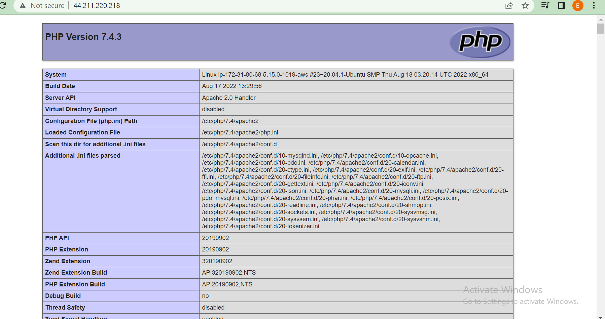

# PROJECT-1 DOCUMENTATION

## STEP 1 - Installing Apache and Updating the Firewall

### update a list of packages in package manager
`sudo apt update`

### run apache2 package installation
`sudo apt install apache2`

### verifying that apache2 is running in the OS
`sudo systemctl status apache2`

**The color is green, which shows i've launched my web server correctly**

### retreiving my IP address using command
`curl -s http://169.254.169.254/latest/meta-data/public-ipv4`

### web server properly installed

### added rule to open inbound connection through port 80

### Accessing our ubuntu server using an DNS
`curl http://localhost:80`

### Accessing our ubuntu server using an ip address
`curl http://127.0.0.1:80`

## STEP 2 - INSTALLING MYSQL
`$ sudo apt install mysql-server`

### login into the mysql
` sudo mysql`

### run security script then exit the mysql afterwards
`ALTER USER 'root'@'localhost' IDENTIFIED WITH mysql_native_password BY 'PassWord.1';`

`exit`

### start the interactive script
`$ sudo mysql_secure_installation`

### Login into mysql
`sudo mysql -p`
**Note: the -p will prompt for your password request**

## STEP 3- INSTALLING PHP/PHP-MYSQL/LIBAPACHE2-MOD-PHP
**PHP is the component of our setup that will process code to display dynamic content to the end user. In addition to the php package, you’ll need php-mysql, a PHP module that allows PHP to communicate with MySQL-based databases. You’ll also need libapache2-mod-php to enable Apache to handle PHP files.**
`sudo apt install php libapache2-mod-php php-mysql`

### Run my php version
`php -v`

## STEP 4- CREATING A VIRTUAL HOST FOR MY WEBSITE USING APACHE

### set up a domain name called lampproject and create a directory for lampproject using mkdir
`sudo mkdir /var/www/lampproject`
**Assign ownwership of the directory with your current system user**
`sudo chown -R $USER:$USER /var/www/lampproject`

### create and open a new configuration file in Apache’s sites-available directory using your preferred command-line editor. Here, we’ll be using vi or vim (They are the same by the way):
`sudo vi /etc/apache2/sites-available/lampproject.conf`

**This will create a new blank file. Paste in the following bare-bones configuration by hitting on i on the keyboard to enter the insert mode,**

**and paste the text:**
`<VirtualHost *:80>
    ServerName lampproject
    ServerAlias www.lampproject 
    ServerAdmin webmaster@localhost
    DocumentRoot /var/www/lampproject
    ErrorLog ${APACHE_LOG_DIR}/error.log
    CustomLog ${APACHE_LOG_DIR}/access.log combined
</VirtualHost>`

**To save and close the file, simply follow the steps below:
Hit the esc button on the keyboard
Type :
Type wq. w for write and q for quit
Hit ENTER to save the file**

### check the files in the available site directory
`sudo ls /etc/apache2/sites-available`

### Enable the new virtual host
`sudo a2ensite lampproject`

### Disable Apache default website
**You might want to disable the default website that comes installed with Apache. This is required if you’re not using a custom domain name, because in this case Apache’s default configuration would overwrite your virtual host. To disable Apache’s default website use a2dissite command**
`sudo a2dissite 000-default`

### Reload Apache so the changes take effect
`sudo systemctl reload apache2`

### create an index.html 
`sudo echo 'Hello LAMP from hostname' $(curl -s http://169.254.169.254/latest/meta-data/public-hostname) 'with public IP' $(curl -s http://169.254.169.254/latest/meta-data/public-ipv4) > /var/www/lampproject/index.html`

### using the code below to retrieve the ip address, paste the address on your browser to view the content of your index.html page 
`curl -s http://169.254.169.254/latest/meta-data/public-ipv4`

### using the dns name to access the server
`http://ec2-54-82-250-196.compute-1.amazonaws.com/`

## STEP 5- ENABLE PHP ON YOUR WEBSITE

### start by editing the default directoryIndex setting using
`sudo vim /etc/apache2/mods-enabled/dir.conf`
**Note: here if u have some code already dispalyed, delete it using esc :%d before u hit i to paste the code below**
**hit on i and insert the code below**
`<IfModule mod_dir.c>
        #Change this:
        #DirectoryIndex index.html index.cgi index.pl index.php index.xhtml index.htm
        #To this:
        DirectoryIndex index.php index.html index.cgi index.pl index.xhtml index.htm
</IfModule>`

**save and close the file using esc : wq Enter keys**

**reload so that the changes will take effect**
`sudo systemctl reload apache2`

### craete a new index.php file inside the custom web root folder
`sudo vim /var/www/projectlamp/index.php`

**The above will open a blank page, hit on i to enter the insert mode and insert the code below**
`<?php
phpinfo();`
**save and close the file using esc : wq Enter keys**
**refresh the page using**

### Remove this file because it contains some vital information about your php, if you need it later you can recreate it.
`sudo rm /var/www/projectlamp/index.php`

